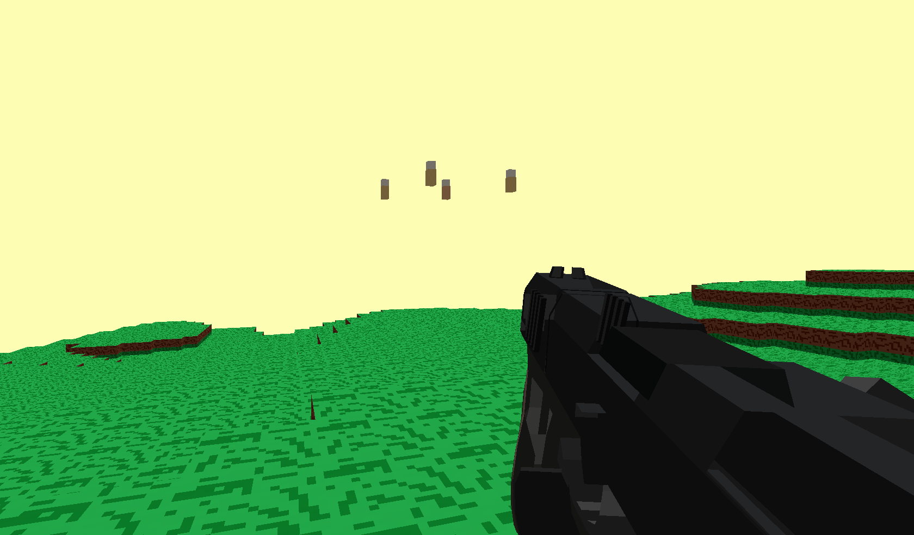

# NeoSurv

An open-world extraction shooter built in Rust with `wgpu` and `winit`.

NeoSurv started as an engine-style experiment and is now evolving into a real game built on top of that voxel foundation.

## Overview

NeoSurv is an in-development open-world extraction shooter with a voxel-based 3D world.
It is focused on movement, combat, enemy encounters, survival pressure, and world systems.

It is currently a personal solo project under active development, which means systems are still changing, bugs are expected, and larger refactors still happen.

The current focus is not to build a generic engine, but to turn the existing technical foundation into a playable game.

## Current Status

**Work in progress.**

The project is already playable in prototype form, but it is still heavily under development.
Expect unfinished systems, missing content, balancing issues, visual rough edges, and occasional breakage while features are being improved.

## Current Features

Current features and active development areas include:

- voxel world rendering
- player movement and shooting
- imported OBJ weapon models
- early enemy and spawn systems
- runtime save and load support
- debug and chat command foundations
- menus, HUD, and chat overlays
- ongoing renderer, gameplay, and world iteration

## Direction

NeoSurv is being developed as a game first.
The long-term direction currently includes:

- seeded and more varied world generation
- better terrain variety and environmental detail
- more blocks, props, and structures
- improved enemy behavior and combat feel
- loot and inventory progression
- stronger extraction-shooter gameplay loops
- stronger game flow and menu structure
- more persistent and polished save systems

## Screenshot



## Project Structure

The repository currently contains the Rust game project inside the `NeoSurv/` directory.
Main code and runtime files are located there, including:

- `NeoSurv/src` for source code
- `NeoSurv/assets` for game assets
- `NeoSurv/Config.toml` for local configuration
- `NeoSurv/docs` for architecture notes and development documents

## Build and Run

### Requirements

You need a recent stable Rust toolchain.
The repository includes a `rust-toolchain.toml` pinned to stable and expects standard Rust tooling such as:

- `cargo`
- `rustfmt`
- `clippy`

### Run in development

```bash
cd NeoSurv
cargo run
```

### Run a release build

```bash
cd NeoSurv
cargo run --release
```

## Configuration

Basic runtime options can be adjusted in:

```text
NeoSurv/Config.toml
```

Current configuration includes:

- graphics backend selection (`vulkan` or `opengl`)
- vsync
- window size and title
- mouse sensitivity

## Controls

Current prototype controls include:

- `W`, `A`, `S`, `D` to move
- mouse to look around
- `Shift` to sprint
- `Space` to jump
- `V` to crouch
- left mouse button to fire
- right mouse button for alternate fire / projectile actions
- `F` to fire the selected weapon
- `Q` to throw a grenade
- `E` to interact, such as opening chests
- `1` and `2` to switch weapon slots
- `3` to use a medkit
- `4` to use a grenade
- `T` to open chat
- `/` to open command input directly
- `Escape` to close chat or open the menu
- menu navigation with arrow keys or `W` / `S`, confirm with `Enter`

Controls may still change during development.

## Bug Reports

If you run into bugs, weird behavior, crashes, visual issues, or gameplay problems, please report them.

You can send bug reports here:

- X (formerly Twitter): <https://x.com/muffinonboard?s=21>

Helpful bug reports include:

- what happened
- what you expected to happen
- steps to reproduce it
- your platform or OS
- screenshots or clips, if relevant

A simple format like this is perfect:

```text
Bug:
Expected:
Steps to reproduce:
Platform:
Extra notes:
```

## Notes

This is an actively developed personal project.
Expect refactors, unfinished systems, and larger structural changes as development continues.

Some internal names, module names, or older documentation may still reflect earlier phases of the project.
That cleanup is part of the ongoing development process.

## License

Unless otherwise noted, the source code in this repository is licensed under the GNU General Public License v3.0.

This repository may also contain third-party assets and materials licensed separately.
See `THIRD_PARTY_NOTICES.md` for additional details.
